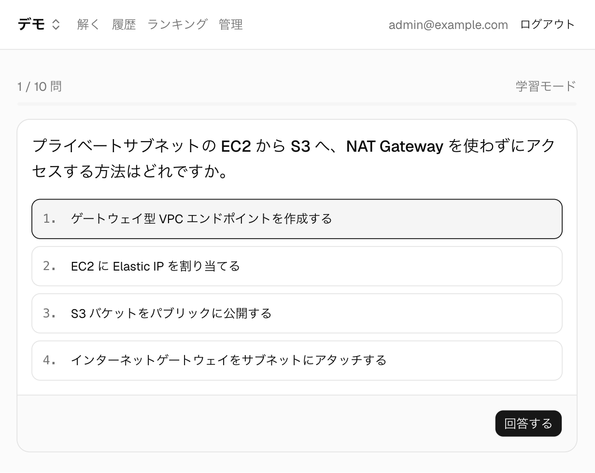
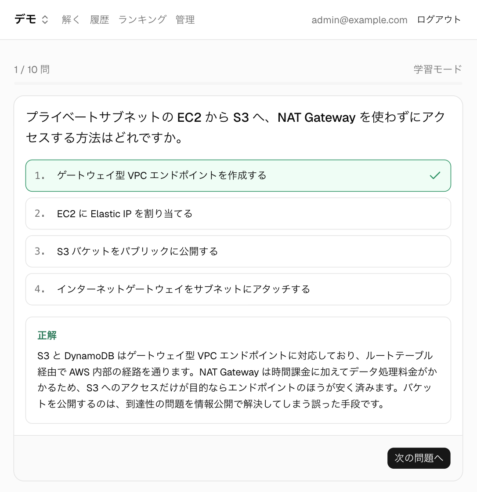
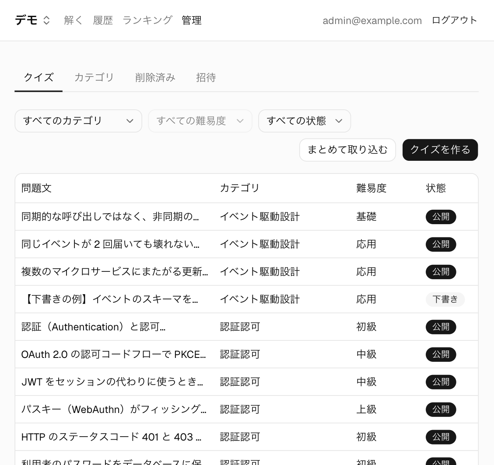
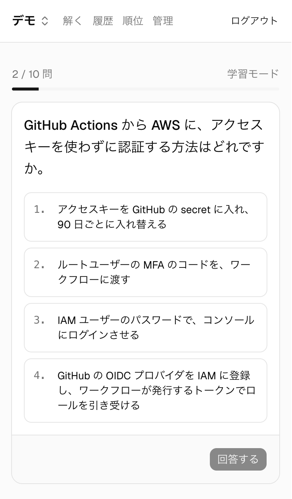
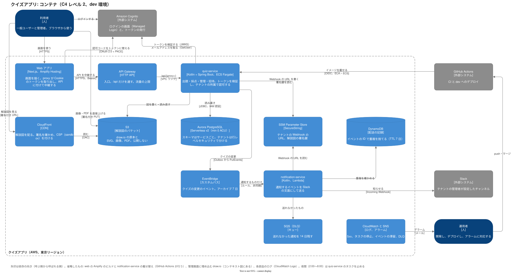
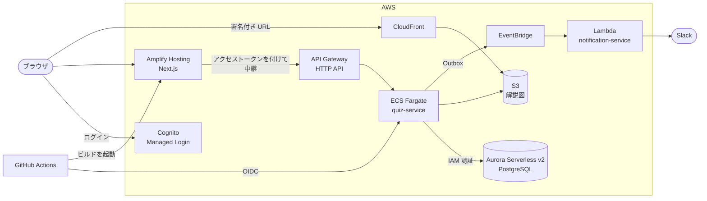

# quiz-app

カテゴリと難易度を自由に定義できるクイズアプリです。特定の分野に依存せず、扱う内容はすべてデータとして登録します。

管理者はそれぞれ独立したクイズ空間（テナント）を持ちます。管理者が登録したカテゴリ・クイズは
そのテナントの中だけに存在し、他のテナントからは見えません。
一般ユーザーは所属するテナントのクイズに回答し、正誤判定と解説を確認できます。
解説は Markdown で書き、draw.io の図・画像・PDF を入れられます。
ログインにはパスキー（WebAuthn）とパスワードを使えます。

デモ用のデータとして、技術系のクイズ（AWS / インフラ、認証認可、イベント駆動設計、このアプリが使っている技術）を収録しています。

実装だけでなく、設計判断の記録（ADR）、Terraform による IaC、GitHub Actions での CI/CD までを一貫して扱っています。

## 画面

| 出題 | 正誤と解説（学習モード） |
| --- | --- |
|  |  |

| 管理画面（クイズの一覧） | スマホの幅 |
| --- | --- |
|  |  |

## 設計上の工夫

- **テナントの境界を、仕組みで守る。** テナント配下の全テーブルに PostgreSQL の行レベルセキュリティを付け、
  アプリが絞り込みを書き忘れても DB が他のテナントの行を返さないようにしています（[ADR-0006](docs/adr/0006-row-level-multi-tenancy.md)）。
  全エンドポイントを Spring から列挙し、別のテナントの ID では結果が返らないことを確かめるテスト（[`TenantBoundaryApiTest`](services/quiz-service/src/test/kotlin/com/quizapp/tenant/TenantBoundaryApiTest.kt)）があり、
  検証のないエンドポイントを足すと落ちます。行レベルセキュリティを付け忘れたテーブルは [`TenantIsolationTest`](services/quiz-service/src/test/kotlin/com/quizapp/tenant/TenantIsolationTest.kt) が見つけます
- **API の定義はコードから作り、画面の型までつなぐ。** OpenAPI の定義を Kotlin のコードから生成してリポジトリに固定し、
  定義からフロントの API クライアント（TanStack Query のフックと Zod のスキーマ）を生成します。定義とずれた応答は、画面で壊れる前に Zod の検証で落ちます
  （[ADR-0010](docs/adr/0010-generate-openapi-from-code.md)）
- **マージすれば dev に載る。** GitHub Actions は OIDC で AWS のロールを引き受け、アクセスキーを発行していません。
  dev で動いているものと比べて、変わったもの（quiz-service / web）だけを載せます。マイグレーションはサービスを入れ替える前に単発のタスクで流し、
  最後にスモークテストで web → API → DB のつながりを確かめます（[ADR-0015](docs/adr/0015-deploy-by-registering-task-definitions-from-ci.md)、[deploy-dev.yml](.github/workflows/deploy-dev.yml)）。
  PR では、ログインや招待、ロールによる出し分けを Playwright の E2E テストで確かめます
- **使っていない時間の費用をほぼ 0 にする。** Aurora Serverless v2 は使われていないと一時停止し（min 0 ACU）、ロードバランサーと NAT Gateway は置かず、
  API の入口は API Gateway（HTTP API）にしています（[ADR-0013](docs/adr/0013-run-ecs-tasks-in-public-subnets.md)、[ADR-0019](docs/adr/0019-expose-api-through-api-gateway-http-api.md)）。
  止められない費用は月に数ドルです（[コスト方針](docs/development-guidelines.md#8-コスト方針)）
- **利用者が上げたものを、そのまま配らない。** 解説図の SVG はアプリのオリジンから返さず、CloudFront が CSP（`sandbox`）を付けて署名付き URL で配ります。
  画像は中身で種類を確かめて読み直し、位置情報などのメタデータを落とします（[ADR-0017](docs/adr/0017-deliver-figures-with-cloudfront-signed-urls.md)、[ADR-0020](docs/adr/0020-reference-figures-from-explanations-and-add-images-and-pdfs.md)）
- **異常に気づき、戻せる。** ログは JSON で出し、要求の ID・テナント・利用者で 1 本の要求を追えます。アプリの 5xx、タスクの停止、イベントの滞留はアラームがメールで知らせ、
  夜間の停止や Aurora の一時停止といったふつうの動きでは鳴らないようにしています。状態は CloudWatch のダッシュボードの 1 画面で見て、
  鳴ったときに何を見てどう戻すかは [Runbook](docs/runbook.md) にあります
- **判断の根拠を残す。** 技術選定と設計のトレードオフを、採らなかった案とともに [ADR](docs/adr/) に残しています（27 本）

## アーキテクチャ

C4 モデルの 2 段で描いています。原本は draw.io（`docs/architecture/*.drawio`）です。

- **システムコンテキスト**（[context.svg](docs/architecture/context.svg)）: 誰が使い、外のどのシステムとつながるか
- **コンテナ**（[container.svg](docs/architecture/container.svg)）: 中の部品と、その間で何をどう送るか（dev 環境）



要点だけを 1 枚にすると、次のとおりです。



## 技術スタック

| 領域 | 技術 | 決めた記録 |
| --- | --- | --- |
| バックエンド | Kotlin 2.3 + Spring Boot 4.1 (Java 21)、Spring Data JDBC、Flyway | [ADR-0002](docs/adr/0002-use-kotlin-and-spring-boot.md)、[ADR-0008](docs/adr/0008-use-spring-boot-4.md)、[ADR-0009](docs/adr/0009-use-spring-data-jdbc.md) |
| フロントエンド | Next.js (App Router) + TypeScript + Tailwind CSS + shadcn/ui、TanStack Query、Zod | [ADR-0003](docs/adr/0003-use-nextjs-for-frontend.md) |
| DB | Aurora PostgreSQL Serverless v2 (min 0 ACU)。アプリとマイグレーションは IAM 認証で接続 | [ADR-0014](docs/adr/0014-connect-to-aurora-with-iam-auth.md) |
| 認証 | Amazon Cognito（Managed Login、パスキー + パスワード） | [ADR-0016](docs/adr/0016-authenticate-with-cognito-managed-login.md) |
| 実行基盤 | ECS Fargate + API Gateway（HTTP API）、Amplify Hosting（フロント） | [ADR-0012](docs/adr/0012-serve-frontend-on-amplify-hosting.md)、[ADR-0019](docs/adr/0019-expose-api-through-api-gateway-http-api.md) |
| ファイル | S3 + CloudFront（署名付き URL） | [ADR-0017](docs/adr/0017-deliver-figures-with-cloudfront-signed-urls.md) |
| 非同期 / 通知 | EventBridge + Lambda + Slack Webhook。Outbox から送り、受け手が重複を捨てる | [ADR-0022](docs/adr/0022-publish-quiz-events-through-outbox-and-notify-slack-per-tenant.md) |
| IaC | Terraform | [ADR-0011](docs/adr/0011-terraform-state-and-environments.md) |
| CI/CD | GitHub Actions（OIDC） | [ADR-0015](docs/adr/0015-deploy-by-registering-task-definitions-from-ci.md) |
| API 定義 | OpenAPI（コードから生成し、フロントの型を自動生成） | [ADR-0010](docs/adr/0010-generate-openapi-from-code.md) |
| テスト | JUnit 5 + Testcontainers、Vitest、Playwright、Postman / Newman | |

## ディレクトリ構成

```
.
├── apps/
│   └── web/                     # Next.js フロントエンド
├── services/
│   ├── quiz-service/            # クイズ / カテゴリ / 難易度の CRUD、出題と採点
│   └── notification-service/    # EventBridge から起動し Slack へ通知する Lambda
├── infra/
│   └── terraform/
│       ├── bootstrap/           # tfstate を置く S3 バケット
│       ├── account/             # アカウントに 1 つだけ置くもの（予算、OIDC のプロバイダ）
│       ├── modules/             # 再利用するモジュール
│       └── envs/                # dev / prod の環境定義
├── tests/
│   ├── api/                     # API のスモークテスト（Postman / Newman）
│   ├── e2e/                     # 画面の E2E テスト（Playwright）
│   └── load/                    # 負荷試験（k6）
├── docs/
│   ├── adr/                     # アーキテクチャ決定記録（MADR 形式）
│   ├── architecture/            # C4 図・draw.io 原本
│   ├── api/                     # OpenAPI 定義
│   ├── load-test.md             # 負荷試験の手順と結果
│   └── runbook.md               # 異常に気づいたときの手順
└── .github/workflows/           # GitHub Actions のワークフロー
```

サービスの境界は DB スキーマ単位で分離します。回答・採点・履歴を担う `answer` は、
`quiz-service` 内のモジュールとして実装し、物理的には分けないと判断しました。
分けたときの費用と往復に、独立したデプロイとスケールが見合わないためです。
判断の過程は [ADR-0004](docs/adr/0004-split-services-incrementally.md) と [ADR-0023](docs/adr/0023-keep-answer-as-module-in-quiz-service.md) を参照してください。

## 動かしてみる

アプリ一式を Docker で起動できます。**ログインには Amazon Cognito の User Pool が要ります**（ローカルでも同じ）。
User Pool は Terraform（`infra/terraform/envs/dev`）で作り、その出力を `.env` に入れます。

```bash
cp .env.example .env          # AUTH_* を埋める（書き方は .env.example）
docker compose up
```

`http://localhost:3000` を開き、ログインの画面（Cognito）でアカウントを作ると、最初は「招待を受けていない」と表示されます。
デモ用のテナントに入るには、シードのデモ管理者に自分のメールアドレスを割り当てます
（[最初の管理者](docs/development-guidelines.md#最初の管理者)）。管理者として所属するテナントでは、ヘッダの「管理」からクイズやカテゴリを編集でき、
「招待」から別の人を招待するリンクを作れます。

| | 場所 |
| --- | --- |
| アプリ | `localhost:3000` |
| API 定義（Swagger UI） | `localhost:8080/swagger-ui.html` |
| PostgreSQL | `localhost:5432` |
| LocalStack | `localhost:4566` |

ポートがほかのアプリと重なるときは、`.env` で変えてください。

## ローカル開発

開発ツールのバージョンは [mise](https://mise.jdx.dev/) で固定しています（Java 21 / Node.js 22 / pnpm）。
アプリをホストで動かすときは、依存サービスだけをコンテナで起動します。

```bash
brew install mise
echo 'eval "$(mise activate zsh)"' >> ~/.zshrc   # 初回のみ
mise install                                     # .mise.toml のバージョンを導入
mise exec -- lefthook install                    # commit の前に secret を探すフックを入れる

docker compose up -d postgres localstack
set -a && source .env && set +a                  # ログインの設定（AUTH_*）を読み込む
SPRING_PROFILES_ACTIVE=dev,migrate ./gradlew :services:quiz-service:bootRun   # マイグレーションを流して終了する
SPRING_PROFILES_ACTIVE=dev ./gradlew :services:quiz-service:bootRun
pnpm install && pnpm --filter web dev
```

アプリは起動時にマイグレーションしません。`dev,migrate` で流すと、デモ用のカテゴリとクイズも投入されます。

詳細は [開発ガイドライン](docs/development-guidelines.md#7-ローカル開発) を参照してください。

## ドキュメント

- [ロードマップ](docs/ROADMAP.md)
- [ADR](docs/adr/)
- [開発ガイドライン](docs/development-guidelines.md)
- [要件定義](docs/requirements.md)
- [ドメインモデル](docs/domain-model.md)
- [DB スキーマ設計](docs/db-schema.md)
- [OpenAPI 定義](docs/api/openapi.yaml)

## 設計方針

- **常にデプロイ可能な状態を保つ** — 機能を増やす前に CI/CD を通し、以降は「マージすれば動く」状態を維持する
- **判断の根拠を残す** — 技術選定とトレードオフは [ADR](docs/adr/) に記録する
- **段階的にサービスを分割する** — ドメイン境界が固まるまでは単一サービスで実装し、DB スキーマとドメインイベントで境界のみ先に引く
- **コストを設計に織り込む** — Aurora Serverless v2 の min 0 ACU、NAT Gateway 不使用、イベント駆動による常駐リソースの削減

詳細は [ロードマップ](docs/ROADMAP.md) を参照してください。

## ステータス

Phase 1（ローカルで動く MVP）、Phase 2（AWS 基盤と継続的デリバリ）、Phase 4（管理機能の作り込み）、Phase 5（イベント駆動と Slack 通知）を終えています。
いまは Phase 6（品質と運用）と Phase 7（公開）を進めています。Phase 3（パスキー認証とロール分離）は Cognito で動かし、パスキーの自前実装は設計を決めたうえで見送りました（[ADR-0027](docs/adr/0027-design-self-hosted-passkeys-and-keep-cognito.md)）。

- クイズ・カテゴリ・難易度の管理から、出題・回答・結果の確認までひと通り動きます。回答の履歴、カテゴリごとの正答率、テナント内のランキングも見られます。スマホの幅でも操作できます
- 解説は Markdown で書き、draw.io で描いた図と、画像・PDF を入れられます。PDF は 1 ページ目を画像にして解説の中に出します
- テナントの分離は、行レベルセキュリティと、全エンドポイントを対象にしたテナント境界のテストで守っています
- AWS 上の dev 環境（ネットワーク・Aurora Serverless v2・ECS Fargate・API Gateway・Amplify Hosting・CloudFront）は Terraform で構築しています。
  develop へのマージで自動でデプロイされ、最後にスモークテストが流れます。AWS への認証は OIDC で、アクセスキーは発行していません
- ログインは Amazon Cognito（Managed Login、パスキー + パスワード）です。トークンはブラウザに渡さず、web のサーバーが暗号化した Cookie に持ちます。
  利用者の ID は Cognito から切り離してあり、あとで自前のパスキーの実装に差し替えます（[ADR-0016](docs/adr/0016-authenticate-with-cognito-managed-login.md)）
- 管理者は、一般ユーザーと管理者を招待できます。招待のリンクを画面に出して渡し、受け入れるときにメールアドレスが招待と一致するかを確かめます
- 管理者がテナントを公開すると、ログインした人が一覧から見つけて、招待なしで参加できます（[ADR-0025](docs/adr/0025-let-signed-in-users-join-public-tenants.md)）
- クイズの追加・更新は、テナントの管理者が設定した Slack に知らせます（Outbox → EventBridge → Lambda。[ADR-0022](docs/adr/0022-publish-quiz-events-through-outbox-and-notify-slack-per-tenant.md)）
- 権限まわり（ログイン・招待・ロールによる出し分け・公開テナントへの参加）と、出題・管理の主な流れは、Playwright の E2E テストで PR ごとに確かめています
- ログは JSON で出し、アラームと CloudWatch のダッシュボードで見ています。鳴ったときの手順は [Runbook](docs/runbook.md) にあります

進捗は [ロードマップ](docs/ROADMAP.md) を参照してください。
