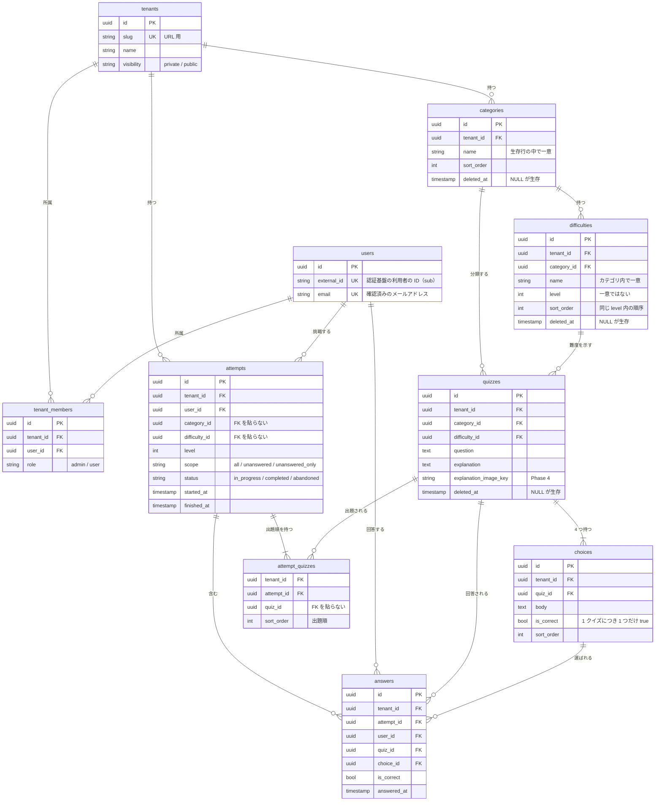

# ドメインモデル

クイズを構成する概念と、その持ち方の決定を記録します。
テナント分離の方式は [ADR-0006](adr/0006-row-level-multi-tenancy.md) を前提とします。

このドキュメントは **何をデータとして持つか** を決めるものです。
テーブル定義の詳細（型・制約・インデックス）は [DB スキーマ設計](db-schema.md) にあります。

---

## テナント

管理者ごとに独立したクイズ空間。カテゴリ・難易度・クイズはすべてテナントに属します。

**1 人のユーザーは複数のテナントに所属できます。** 管理者が他のテナントに一般ユーザーとして参加することもできます。

単一所属に見える要件でも、複数所属を前提に作ります。後から単一に絞るのは制約を足すだけで済みますが、
単一前提で作ったものを複数対応にするには、ユーザーとテナントの関係を持つテーブルを新設し、
既存のすべての参照を書き換える必要があるためです。

### 招待

テナントへの所属は、管理者の招待で増えます（[要件定義の招待フロー](requirements.md#招待フローphase-3)）。
**招待は利用者ではなく、メールアドレスに対して作ります。** 招待する時点では、相手がまだサインアップしていないことがあるためです。
受け入れるときに、ログインした人の確認済みのメールアドレスと比べます。

招待の状態は、受け入れ待ち・期限切れ・使用済み・取り消しの 4 つです。
**使用済みと取り消しは、期限より優先します。** 期限が過ぎても、使ったことや取り消したことは変わりません。

---

## カテゴリ

クイズの分類。**階層を持たせず、フラットにします。**

### 決定の理由

階層は「あると便利そう」に見えますが、次のコストを伴います。

- 出題時に親カテゴリを選んだら子カテゴリも含めるのか、という判断がクエリごとに必要になる
- 親を削除したときに子をどうするか（連鎖削除 / 昇格 / 削除拒否）を決める必要がある
- 管理 UI にツリー表示と並び替えが必要になる

いずれも実装量が増える割に、クイズが数十〜数百件の段階では効果が見えません。
カテゴリ数が増えて整理が必要になってから `parent_id` を足す方が、判断の材料が揃います。
**フラットから階層への移行では、既存データをすべてルート扱いにすればよく、データ移行の危険が小さい**のも理由です。

### 持つもの

| 項目 | 内容 |
| --- | --- |
| テナント | どのテナントのカテゴリか |
| 名前 | 表示名。**テナント内で一意** |
| 説明 | 任意。管理画面での補足 |
| 並び順 | 管理者が任意に並べ替える。名前順に固定しない |

---

## 難易度

**難易度はカテゴリごとに定義します。** システムが段階数も名前も固定しません。

### 決定の理由

適切な尺度は分野によって異なります。「初級 / 中級 / 上級」で足りる領域もあれば、
`CLF / SAA / SAP` のように既存の資格体系へ合わせたい領域もあります。
同じテナントの中でも、カテゴリごとに適切な尺度は変わります。

テナント共通のマスタにすると、名前を全カテゴリで統一せざるを得ません。
カテゴリに紐づけることで、分野ごとに自然な呼び方を使えます。

### 持つもの

| 項目 | 内容 |
| --- | --- |
| テナント | どのテナントの難易度か |
| カテゴリ | **どのカテゴリの難易度か** |
| 名前 | 表示名。**カテゴリ内で一意** |
| レベル | 整数。難易度の**大小を表す**。**一意ではない**（同じレベルの難易度が複数あってよい） |
| 並び順 | 同じレベル内での表示順 |
| 説明 | 任意。「どういう問題をこの難易度にするか」の判定基準を管理者が書く |

### 受け入れるトレードオフ

- **選択順序が固定される。** 出題はカテゴリを選んでから難易度を選ぶ。難易度を先に選ぶ導線は作れない
- **カテゴリ作成の手間が増える。** カテゴリを作るたびに難易度を定義する必要があり、作成直後はクイズを登録できない
- **整合性の検証が必要になる。** クイズ登録時に、指定された難易度がそのクイズのカテゴリに属するかを確認しなければならない。
  この検証を忘れると、別カテゴリの難易度が付いたクイズが作れてしまう

### 同じレベルに複数の難易度を持てる

レベルは一意ではありません。同じレベルの難易度を並べられます。

```
カテゴリ「AWS」
├─ CLF  (レベル 1)
├─ SAA  (レベル 2)  ← 同じレベル
├─ DVA  (レベル 2)  ← 同じレベル
├─ SOA  (レベル 2)  ← 同じレベル
├─ SAP  (レベル 3)  ← 同じレベル
└─ DOP  (レベル 3)  ← 同じレベル
```

AWS の資格のように、**同じ難度帯に複数の種類が並ぶ**体系があるためです。
アソシエイト級には SAA / DVA / SOA が、プロフェッショナル級には SAP / DOP があります。
レベルを一意にすると、この体系を表現できません。

これにより、次の 2 つの出題が両方できます。

| 要求 | 指定 |
| --- | --- |
| SAA だけ解きたい | 難易度 `SAA` |
| アソシエイト級を全部解きたい | レベル `2`（SAA / DVA / SOA が対象） |

**名前が識別子、レベルは尺度**という役割分担です。
レベルが一意でないため、同じレベル内の表示順は並び順で決めます。

### カテゴリを分ける運用も選べる

同じ体系は、カテゴリ側を細かくしても表現できます。

```
カテゴリ「AWS - ソリューションアーキテクト」→ SAA (1) / SAP (2)
カテゴリ「AWS - DevOps」→ DVA (1) / DOP (2)
```

どちらが使いやすいかは運用してみないと分かりません。
**システムはどちらかを強制せず、管理者が選べる状態にします。**

### レベルによるカテゴリ横断

名前がカテゴリごとに異なっても、**レベル（整数）はカテゴリをまたいだ共通の尺度として使えます。**

`AWS / CLF`（レベル 1）と `認証認可 / 初級`（レベル 1）は名前が違いますが、
どちらもレベル 1 として扱えるため、「レベル 1 の問題を解く」という横断的な出題が可能です。

名前は分野ごとの呼び方、レベルは共通の尺度、という役割分担にします。

---

## 出題

出題の指定は**独立した 3 つの軸**で表します（[要件定義](requirements.md)）。

| 軸 | 値 |
| --- | --- |
| 出題対象 | すべて / 未回答優先 / 未回答のみ |
| 並び | ランダム / 登録順 |
| 出題数 | 1〜100 |

これらはカテゴリ・難易度による絞り込みと組み合わせます。

**未回答優先**は、未回答を先に出して尽きたら回答済みで埋めます。
一度正解した問題を二度と出さない理由がなく、指定した数に満たない結果は利用者の期待と異なるためです。

**未回答のみ**は埋めません。「このカテゴリを一周する」という使い方では、
残りが何問あるかが意味を持ち、回答済みが混ざると用をなさないためです。

未回答かどうかの判定は、**挑戦をまたいだ全期間の回答履歴**を見ます。挑戦の単位では判定しません。

### ドメインに現れないもの

**正誤と解説をいつ返すか**（学習モード / 模試モード）は表示の選択であり、構造には現れません。
サーバーは常に回答の応答で正誤と解説を返し、まとめて見せるかどうかはクライアントが決めます。

---

## クイズ

- 4 択問題。**選択肢はちょうど 4 つ、正解はちょうど 1 つ**
- カテゴリと難易度をそれぞれ 1 つ持つ
- 解説は文章と図（Phase 4 で draw.io の SVG を追加）
- **下書き / 公開の状態を持つ。** 出題されるのは公開されたものだけ

作りかけのクイズが利用者に出題されないよう、状態を持たせます。
既定は下書きで、管理者が明示的に公開します。

選択肢数と正解数の制約は、アプリケーションではなくドメインの不変条件として扱います。
「選択肢が 3 つしかないクイズ」や「正解が 2 つあるクイズ」は、出題も採点も成立しないためです。

---

## 回答

- 誰が、どのクイズに、どの選択肢で答え、正解だったか
- **`user_id` と `quiz_id` で持ちます。** 回答にテナントを持たせません

将来テナントを公開したとき、所属していないユーザーがクイズを解きます。
回答をテナント単位で持っていると、この時点で「どのテナントの回答か」が意味を失います
（[ADR-0006](adr/0006-row-level-multi-tenancy.md)）。
クイズからテナントは辿れるため、集計が必要になれば結合で対応できます。

---

## 挑戦

**1 回のクイズセッションを「挑戦」として持ちます。** 回答はいずれかの挑戦に属します。

- 出題条件（カテゴリ・難易度・レベル・出題対象）
- 出題されたクイズと、その順序
- 状態（回答中 / 完了 / 破棄）

回答だけを persistent に持つと、「10 問中 7 問正解」を表せません。
結果画面にもランキングにも、**どこからどこまでが 1 回か**という区切りが要ります。

### 最初から持つ理由

**後から足せないためです。** 既存の回答に「どの挑戦だったか」を後付けしても、
記録が残っていない以上、時刻の間隔から推測するしかありません。

挑戦を持つと、中断と再開もサーバー側で完結します（[要件定義](requirements.md)）。
出題順を挑戦に持たせれば、ブラウザに状態を置く必要がなくなります。

### 集計の単位を分ける

| 集計 | 対象 |
| --- | --- |
| 正答率・未回答判定（**回答単位**） | 状態を問わずすべての回答 |
| 挑戦回数・平均スコア（**挑戦単位**） | 完了した挑戦のみ |

中断したまま終わった挑戦にも、実際に解いた回答があります。
**解いた事実は消えない**ので、未回答判定からは外せません。
一方で「10 問中 3 問で止めたもの」を挑戦回数に数えると、スコアの比較が成立しなくなります。

### 解き直しは上書きしない

同じクイズに何度答えても、**回答は 1 行ずつ残します。**
未回答優先の出題で回答済みも出す以上、解き直しは例外ではなく通常の導線で起きます。

履歴を上書きすると「間違えたあと正解した」という学習の過程が消えます。
どの回答を採用するかは集計する側の判断であり、保存する側で決めません。

### カテゴリ別の正答率

履歴の画面に出す正答率は、**いま出題できるクイズへの、クイズごとに最新の回答**で数えます。

| 決めたこと | 理由 |
| --- | --- |
| 同じクイズへの回答は、最新の 1 回だけを数える | 「いまわかっているか」を表すため。延べで数えると、最初のころの誤りが率に残り続ける |
| 削除・非公開にしたクイズへの回答は数えない | 誤りがあって消した問題が率に残らず、カテゴリの構成もいまの出題と一致する |
| 分母は解いたクイズの数。出題できるクイズの数も並べて出す | 解いていない問題を不正解として数えると、正答率と進み具合が混ざる |
| 挑戦ごとの成績は、記録した回答のまま残す | 挑戦の結果は「そのとき何問正解したか」の記録であり、あとの編集で変えない |

クイズのカテゴリは回答に持たせず、集計のたびに quiz モジュールへ問い合わせます（[ADR-0004](adr/0004-split-services-incrementally.md)）。
クイズを別のカテゴリへ移すと、集計もそれに従います。
見られるのは本人の記録だけです。管理者が利用者ごとの成績を見る機能は持ちません。

---

## 削除

カテゴリ・難易度・クイズ・選択肢・テナント・所属は**論理削除**します（[ADR-0007](adr/0007-soft-delete-master-data.md)）。
`deleted_at` を持ち、NULL が生存を表します。

回答（`answers`）は削除しません。履歴そのものであり、削除する操作を設けないためです。
選択肢もクイズに完全に従属するため、単独では削除しません。クイズの状態が見え方を決めます。

物理削除するとクイズを参照する回答履歴が意味を失い、誤削除からの復旧もできなくなります。
代償として、**すべてのクエリに「削除済みを除く」条件が必要**になります。

### 連鎖の向き

削除は**下へ**連鎖します。上へは連鎖しません。

| 消すもの | 一緒に消えるもの |
| --- | --- |
| カテゴリ | 配下の難易度とクイズ |
| 難易度 | その難易度のクイズ |
| クイズ | なし |

難易度を消すとクイズも消えるのは、**難易度を失ったクイズが出題も編集もできなくなる**ためです。
親を残したまま子だけを消せる関係ではありません。

### 「一緒に消えたもの」の単位

復活は、**同じ削除操作で消えたものだけ**を戻します。
削除のたびに ID（`deletion_batch_id`）を振り、同じ操作で消えたことを列として持ちます。

`deleted_at` の一致で判定する方法もありますが、**同じ時刻になったのが偶然か意図かを区別できません。**
「カテゴリを消す直前に、別の理由でクイズを 1 問消していた」場合に、
カテゴリの復活でそのクイズまで戻ってしまいます。

この単位により、次の順序でも破綻しません。

1. カテゴリを削除する（配下がすべて同じバッチになる）
2. クイズを 1 問だけ個別に復活させる（バッチが外れる）
3. カテゴリを復活させる（すでに戻っている行には触れない）

---

## ER 図（初版）

型・制約・インデックスは DB 設計（DEV-17）で確定します。ここでは関連と主要な項目のみ示します。



### 図から読み取れる注意点

- **`quizzes` は `categories` と `difficulties` の両方を参照します。** この 2 つは親子関係にあるため、
  組み合わせが矛盾しないことをアプリケーションか DB 制約で保証する必要があります
- **`attempts` / `attempt_quizzes` / `answers` も `tenant_id` を持ち、RLS の対象です。**
  本人確認（`user_id`）だけでは、複数のテナントに所属する利用者の挑戦をテナントごとに区別できないためです（DEV-37）
- **`attempts` / `attempt_quizzes` から quiz スキーマへの外部キーを貼りません。**
  `answers.quiz_id` と同じ理由で、answer モジュールを分離するときの障害になるためです（[ADR-0004](adr/0004-split-services-incrementally.md)）。
  参照先が消えうることを前提に、**再開時に出題リストを検証します**
- **未完了の挑戦はテナントごとに 1 ユーザー 1 件まで。** 部分ユニークインデックス（`(tenant_id, user_id) WHERE status = 'in_progress'`）で保証します
- `tenant_members` は `tenant_id` と `user_id` の組で一意になります。同じ人が複数テナントに所属できます
- **ユニーク制約は生存行のみを対象にします。** 削除済みと同じ名前で作り直せるようにするため、
  PostgreSQL の部分インデックス（`WHERE deleted_at IS NULL`）を使います

---

## 初期データ

デモ環境に投入するサンプルです。**アプリの仕様ではありません。**

| カテゴリ | 難易度（カッコ内はレベル） |
| --- | --- |
| AWS / インフラ | CLF (1) / SAA (2) / DVA (2) / SOA (2) / SAP (3) |
| イベント駆動・マイクロサービス設計 | 初級 (1) / 中級 (2) / 上級 (3) |
| 認証認可 | 初級 (1) / 中級 (2) / 上級 (3) |
| バックエンド設計 | 初級 (1) / 中級 (2) / 上級 (3) |

AWS のカテゴリだけ資格の級を使っています。カテゴリごとに異なる尺度を持てることと、
同じレベル（アソシエイト級の SAA / DVA / SOA）に複数の難易度を並べられることの例です。
名前は違っても、レベルが同じ難易度はカテゴリをまたいで比較できます。

新しいテナントはカテゴリが 0 件、新しいカテゴリは難易度が 0 件の状態で始まります。
どちらの状態でもクイズを作れないため、既定の難易度を自動で用意するか、
空の状態から管理者に作らせるかは、画面設計（DEV-13）で決めます。
