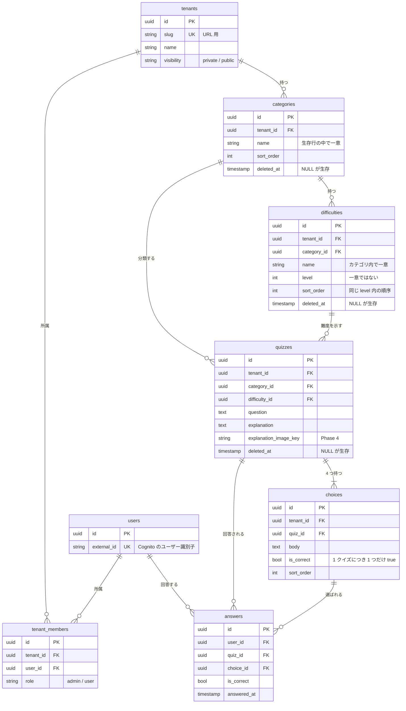

# ドメインモデル

クイズを構成する概念と、その持ち方の決定を記録します。
テナント分離の方式は [ADR-0006](adr/0006-row-level-multi-tenancy.md) を前提とします。

このドキュメントは **何をデータとして持つか** を決めるものです。
テーブル定義の詳細（型・制約・インデックス）は [DB スキーマ設計](db-schema.md) にあります。

---

## テナント

管理者ごとに独立したクイズ空間。カテゴリ・難易度・クイズはすべてテナントに属します。

**1 人のユーザーは複数のテナントに所属できます。** 管理者が他のテナントに一般ユーザーとして参加することもできます。

単一所属に見える要件でも、複数所属を前提に作ります。後から単一に絞るのは制約を足すだけで済みますが、
単一前提で作ったものを複数対応にするには、ユーザーとテナントの関係を持つテーブルを新設し、
既存のすべての参照を書き換える必要があるためです。

---

## カテゴリ

クイズの分類。**階層を持たせず、フラットにします。**

### 決定の理由

階層は「あると便利そう」に見えますが、次のコストを伴います。

- 出題時に親カテゴリを選んだら子カテゴリも含めるのか、という判断がクエリごとに必要になる
- 親を削除したときに子をどうするか（連鎖削除 / 昇格 / 削除拒否）を決める必要がある
- 管理 UI にツリー表示と並び替えが必要になる

いずれも実装量が増える割に、クイズが数十〜数百件の段階では効果が見えません。
カテゴリ数が増えて整理が必要になってから `parent_id` を足す方が、判断の材料が揃います。
**フラットから階層への移行では、既存データをすべてルート扱いにすればよく、データ移行の危険が小さい**のも理由です。

### 持つもの

| 項目 | 内容 |
| --- | --- |
| テナント | どのテナントのカテゴリか |
| 名前 | 表示名。**テナント内で一意** |
| 説明 | 任意。管理画面での補足 |
| 並び順 | 管理者が任意に並べ替える。名前順に固定しない |

---

## 難易度

**難易度はカテゴリごとに定義します。** システムが段階数も名前も固定しません。

### 決定の理由

適切な尺度は分野によって異なります。「初級 / 中級 / 上級」で足りる領域もあれば、
`CLF / SAA / SAP` のように既存の資格体系へ合わせたい領域もあります。
同じテナントの中でも、カテゴリごとに適切な尺度は変わります。

テナント共通のマスタにすると、名前を全カテゴリで統一せざるを得ません。
カテゴリに紐づけることで、分野ごとに自然な呼び方を使えます。

### 持つもの

| 項目 | 内容 |
| --- | --- |
| テナント | どのテナントの難易度か |
| カテゴリ | **どのカテゴリの難易度か** |
| 名前 | 表示名。**カテゴリ内で一意** |
| レベル | 整数。難易度の**大小を表す**。**一意ではない**（同じレベルの難易度が複数あってよい） |
| 並び順 | 同じレベル内での表示順 |
| 説明 | 任意。「どういう問題をこの難易度にするか」の判定基準を管理者が書く |

### 受け入れるトレードオフ

- **選択順序が固定される。** 出題はカテゴリを選んでから難易度を選ぶ。難易度を先に選ぶ導線は作れない
- **カテゴリ作成の手間が増える。** カテゴリを作るたびに難易度を定義する必要があり、作成直後はクイズを登録できない
- **整合性の検証が必要になる。** クイズ登録時に、指定された難易度がそのクイズのカテゴリに属するかを確認しなければならない。
  この検証を忘れると、別カテゴリの難易度が付いたクイズが作れてしまう

### 同じレベルに複数の難易度を持てる

レベルは一意ではありません。同じレベルの難易度を並べられます。

```
カテゴリ「AWS」
├─ CLF  (レベル 1)
├─ SAA  (レベル 2)  ← 同じレベル
├─ DVA  (レベル 2)  ← 同じレベル
├─ SOA  (レベル 2)  ← 同じレベル
├─ SAP  (レベル 3)  ← 同じレベル
└─ DOP  (レベル 3)  ← 同じレベル
```

AWS の資格のように、**同じ難度帯に複数の種類が並ぶ**体系があるためです。
アソシエイト級には SAA / DVA / SOA が、プロフェッショナル級には SAP / DOP があります。
レベルを一意にすると、この体系を表現できません。

これにより、次の 2 つの出題が両方できます。

| 要求 | 指定 |
| --- | --- |
| SAA だけ解きたい | 難易度 `SAA` |
| アソシエイト級を全部解きたい | レベル `2`（SAA / DVA / SOA が対象） |

**名前が識別子、レベルは尺度**という役割分担です。
レベルが一意でないため、同じレベル内の表示順は並び順で決めます。

### カテゴリを分ける運用も選べる

同じ体系は、カテゴリ側を細かくしても表現できます。

```
カテゴリ「AWS - ソリューションアーキテクト」→ SAA (1) / SAP (2)
カテゴリ「AWS - DevOps」→ DVA (1) / DOP (2)
```

どちらが使いやすいかは運用してみないと分かりません。
**システムはどちらかを強制せず、管理者が選べる状態にします。**

### レベルによるカテゴリ横断

名前がカテゴリごとに異なっても、**レベル（整数）はカテゴリをまたいだ共通の尺度として使えます。**

`AWS / CLF`（レベル 1）と `認証認可 / 初級`（レベル 1）は名前が違いますが、
どちらもレベル 1 として扱えるため、「レベル 1 の問題を解く」という横断的な出題が可能です。

名前は分野ごとの呼び方、レベルは共通の尺度、という役割分担にします。

---

## 出題

次の 3 つのモードに対応します。

| モード | 動作 |
| --- | --- |
| 全問出題 | 条件に合うクイズをすべて出す |
| 出題数指定 | 条件に合うクイズから、指定された数をランダムに選ぶ |
| 未回答優先 | まだ回答していないクイズを優先して出す |

いずれもカテゴリ・難易度による絞り込みと組み合わせます。

未回答優先は回答履歴を参照するため、**未回答が尽きたときの挙動**を決める必要があります
（回答済みも出す / そこで終了する）。これは API 設計時に確定します。

---

## クイズ

- 4 択問題。**選択肢はちょうど 4 つ、正解はちょうど 1 つ**
- カテゴリと難易度をそれぞれ 1 つ持つ
- 解説は文章と図（Phase 4 で draw.io の SVG を追加）
- **下書き / 公開の状態を持つ。** 出題されるのは公開されたものだけ

作りかけのクイズが利用者に出題されないよう、状態を持たせます。
既定は下書きで、管理者が明示的に公開します。

選択肢数と正解数の制約は、アプリケーションではなくドメインの不変条件として扱います。
「選択肢が 3 つしかないクイズ」や「正解が 2 つあるクイズ」は、出題も採点も成立しないためです。

---

## 回答

- 誰が、どのクイズに、どの選択肢で答え、正解だったか
- **`user_id` と `quiz_id` で持ちます。** 回答にテナントを持たせません

将来テナントを公開したとき、所属していないユーザーがクイズを解きます。
回答をテナント単位で持っていると、この時点で「どのテナントの回答か」が意味を失います
（[ADR-0006](adr/0006-row-level-multi-tenancy.md)）。
クイズからテナントは辿れるため、集計が必要になれば結合で対応できます。

---

## 削除

カテゴリ・難易度・クイズ・選択肢・テナント・所属は**論理削除**します（[ADR-0007](adr/0007-soft-delete-master-data.md)）。
`deleted_at` を持ち、NULL が生存を表します。

回答（`answers`）は削除しません。履歴そのものであり、削除する操作を設けないためです。

物理削除するとクイズを参照する回答履歴が意味を失い、誤削除からの復旧もできなくなります。
代償として、**すべてのクエリに「削除済みを除く」条件が必要**になります。

---

## ER 図（初版）

型・制約・インデックスは DB 設計（DEV-17）で確定します。ここでは関連と主要な項目のみ示します。



### 図から読み取れる注意点

- **`quizzes` は `categories` と `difficulties` の両方を参照します。** この 2 つは親子関係にあるため、
  組み合わせが矛盾しないことをアプリケーションか DB 制約で保証する必要があります
- **`answers` は `tenant_id` を持ちません。** 将来の公開テナント対応のためです
- `tenant_members` は `tenant_id` と `user_id` の組で一意になります。同じ人が複数テナントに所属できます
- **ユニーク制約は生存行のみを対象にします。** 削除済みと同じ名前で作り直せるようにするため、
  PostgreSQL の部分インデックス（`WHERE deleted_at IS NULL`）を使います

---

## 初期データ

デモ環境に投入するサンプルです。**アプリの仕様ではありません。**

| カテゴリ | 難易度（カッコ内はレベル） |
| --- | --- |
| AWS / インフラ | CLF (1) / SAA (2) / DVA (2) / SOA (2) / SAP (3) |
| イベント駆動・マイクロサービス設計 | 初級 (1) / 中級 (2) / 上級 (3) |
| 認証認可 | 初級 (1) / 中級 (2) / 上級 (3) |
| バックエンド設計 | 初級 (1) / 中級 (2) / 上級 (3) |

AWS のカテゴリだけ資格の級を使っています。カテゴリごとに異なる尺度を持てることと、
同じレベル（アソシエイト級の SAA / DVA / SOA）に複数の難易度を並べられることの例です。
名前は違っても、レベルが同じ難易度はカテゴリをまたいで比較できます。

新しいテナントはカテゴリが 0 件、新しいカテゴリは難易度が 0 件の状態で始まります。
どちらの状態でもクイズを作れないため、既定の難易度を自動で用意するか、
空の状態から管理者に作らせるかは、画面設計（DEV-13）で決めます。
