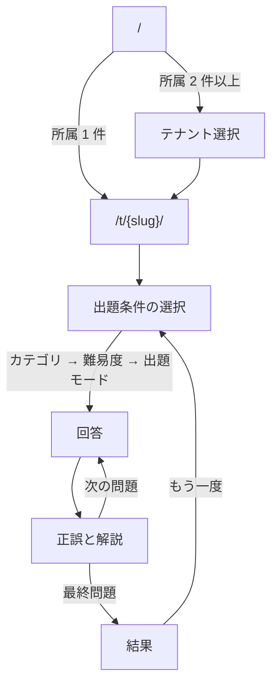
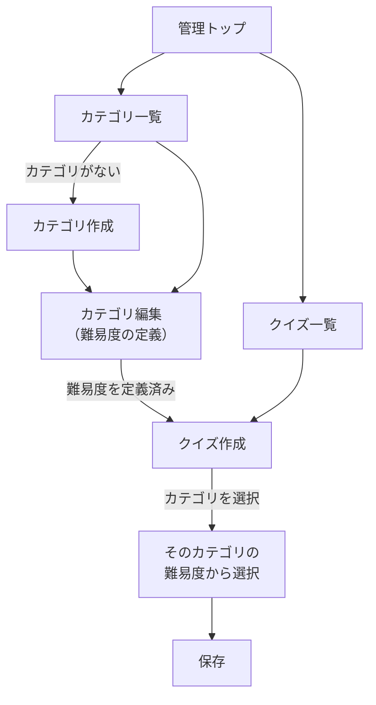
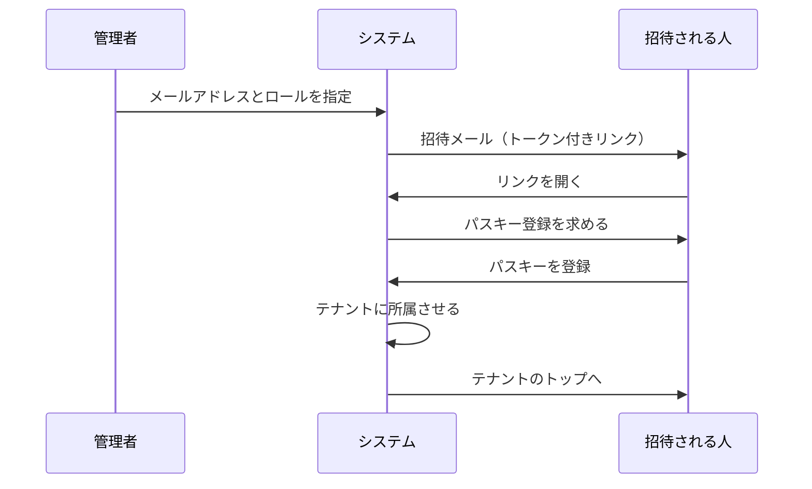

# 要件定義

ユースケース・画面・URL 構成をまとめます。
各概念の持ち方は [ドメインモデル](domain-model.md)、テナント分離の方式は [ADR-0006](adr/0006-row-level-multi-tenancy.md) を参照してください。

各項目には対応するフェーズを記載しています。**Phase 1 の範囲だけを先に作り、認証は Phase 3 で差し替えます。**

---

## ロール

| ロール | 説明 |
| --- | --- |
| 管理者 | テナント内のカテゴリ・難易度・クイズを管理する。招待によって増える |
| 一般ユーザー | テナントに所属し、クイズに回答する |

ロールは**テナントごと**に持ちます。同じ人がテナント A では管理者、テナント B では一般ユーザー、という状態が成立します。

---

## ユースケース

### 一般ユーザー

| # | ユースケース | Phase |
| --- | --- | --- |
| U1 | 招待を受けてテナントに参加する | 3 |
| U2 | 所属テナントを選ぶ | 1 |
| U3 | カテゴリを選ぶ | 1 |
| U4 | 難易度またはレベルを選ぶ | 1 |
| U5 | 出題モードを選ぶ（全問 / 出題数指定 / 未回答優先） | 1 |
| U6 | クイズに回答する | 1 |
| U7 | 正誤と解説を見る | 1 |
| U8 | 結果（スコア）を見る | 1 |
| U9 | 回答履歴・カテゴリ別の正答率を見る | 4 |

### 管理者

| # | ユースケース | Phase |
| --- | --- | --- |
| A1 | カテゴリを作成・編集・削除する | 1 |
| A2 | カテゴリに難易度を定義する | 1 |
| A3 | クイズを作成・編集・削除する | 1 |
| A4 | クイズ一覧を絞り込んで探す | 1 |
| A5 | 解説図（draw.io）を登録する | 4 |
| A6 | 一般ユーザー・管理者を招待する | 3 |
| A7 | テナントの公開設定を変更する | 4 以降 |

---

## URL 構成

テナントは**パスで識別**します（[ADR-0006](adr/0006-row-level-multi-tenancy.md)）。

```
/                                     テナント選択（所属一覧）
/t/{slug}/                            テナントのトップ
/t/{slug}/play                        出題条件の選択
/t/{slug}/play/session                回答中
/t/{slug}/play/result                 結果
/t/{slug}/admin/categories            カテゴリ一覧
/t/{slug}/admin/categories/{id}       カテゴリ編集（難易度の管理を含む）
/t/{slug}/admin/quizzes                クイズ一覧
/t/{slug}/admin/quizzes/new            クイズ作成
/t/{slug}/admin/quizzes/{id}           クイズ編集
```

### 難易度の URL

難易度はカテゴリ配下のリソースのため、独立した一覧画面を持たせません。
カテゴリ編集画面の中で管理します。

### テナント未指定のとき

`/` にアクセスしたときの挙動は所属数で分けます。

| 所属テナント数 | 挙動 |
| --- | --- |
| 0 | 招待を受けていない旨を表示する |
| 1 | そのテナントへ自動で遷移する |
| 2 以上 | テナント選択画面を表示する |

1 件のときに選択画面を挟まないのは、大半の利用者にとって選択肢が 1 つしかない画面が無駄になるためです。

---

## 画面一覧

### 共通

| 画面 | 内容 | Phase |
| --- | --- | --- |
| テナント選択 | 所属テナントの一覧。2 件以上のときのみ表示 | 1 |
| ログイン | パスキー認証。Phase 1 はスタブ | 3 |

### 一般ユーザー

| 画面 | 内容 | Phase |
| --- | --- | --- |
| 出題条件の選択 | カテゴリ → 難易度（またはレベル）→ 出題モード | 1 |
| 回答 | 問題文と 4 択。1 問ずつ表示 | 1 |
| 正誤と解説 | 正誤、正解の選択肢、解説文（Phase 4 で図） | 1 |
| 結果 | 正答数・正答率、間違えた問題の一覧 | 1 |
| 履歴 | 過去の回答、カテゴリ別の正答率 | 4 |

### 管理者

| 画面 | 内容 | Phase |
| --- | --- | --- |
| カテゴリ一覧 | 並び替え、クイズ数の表示 | 1 |
| カテゴリ編集 | カテゴリ情報と**配下の難易度の管理** | 1 |
| クイズ一覧 | カテゴリ・難易度での絞り込み | 1 |
| クイズ編集 | 問題文、4 択、正解、解説文、カテゴリ・難易度の指定 | 1 |
| 招待 | メールアドレスとロールを指定して招待 | 3 |

---

## 画面遷移

### 一般ユーザー（Phase 1）



### 管理者: クイズ作成（Phase 1）



**クイズ作成画面では、カテゴリを選ぶまで難易度を選べません。** 難易度はカテゴリ配下のリソースであり、
カテゴリが決まらなければ選択肢が確定しないためです。カテゴリを変更したときは難易度の選択をリセットします。

---

## 初期状態の扱い

新しいテナントはカテゴリが 0 件、新しいカテゴリは難易度が 0 件で始まります。
どちらの状態でもクイズを作れません。

**既定の難易度を自動生成せず、カテゴリ作成時に難易度も入力させます。**

自動生成しない理由は、生成した難易度がその分野に合わない場合、管理者は「消してから作り直す」ことになるためです。
分野ごとに尺度が異なることを前提にした設計（[ドメインモデル](domain-model.md)）と矛盾します。

カテゴリ作成画面で難易度を最低 1 件入力させれば、「カテゴリはあるがクイズを作れない」状態を避けられます。

---

## 招待フロー（Phase 3）



既存ユーザーを招待した場合は、パスキー登録を挟まずに所属だけを追加します。
**この分岐があるため、招待トークンは「誰を招待したか」ではなく「どのテナントに、どのロールで招待したか」を保持します。**

---

## 未確定事項

| 項目 | 決める時期 |
| --- | --- |
| 出題数の上限、1 セッションの最大問題数 | API 設計（DEV-21） |
| 未回答が尽きたときの挙動 | API 設計（DEV-21） |
| 回答の途中離脱をどう扱うか（再開できるか） | API 設計（DEV-22） |
| カテゴリ削除時に配下の難易度とクイズをどうするか | API 設計（DEV-19） |
| 招待トークンの有効期限 | Phase 3 |
| テナントの作成方法（招待制のため、最初のテナントはシードで作る） | Phase 3 |
