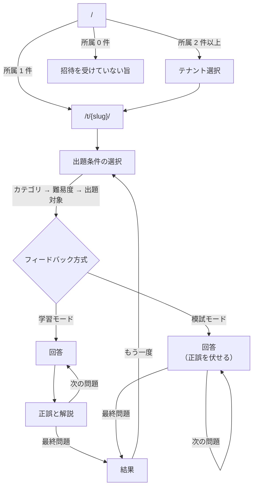
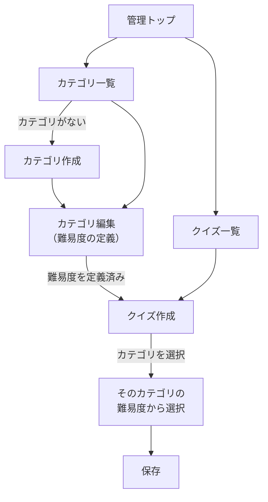
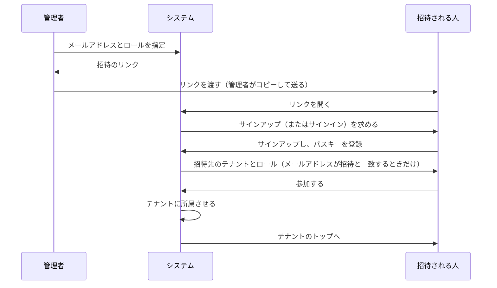

# 要件定義

ユースケース・画面・URL 構成をまとめます。
各概念の持ち方は [ドメインモデル](domain-model.md)、テナント分離の方式は [ADR-0006](adr/0006-row-level-multi-tenancy.md) を参照してください。

各項目には対応するフェーズを記載しています。**Phase 1 の範囲だけを先に作り、認証は Phase 3 で差し替えます。**

---

## ロール

| ロール | 説明 |
| --- | --- |
| 管理者 | テナント内のカテゴリ・難易度・クイズを管理する。招待によって増える |
| 一般ユーザー | テナントに所属し、クイズに回答する |

ロールは**テナントごと**に持ちます。同じ人がテナント A では管理者、テナント B では一般ユーザー、という状態が成立します。

---

## ユースケース

### 一般ユーザー

| # | ユースケース | Phase |
| --- | --- | --- |
| U1 | 招待を受けてテナントに参加する | 3 |
| U2 | 所属テナントを選ぶ | 1 |
| U3 | カテゴリを選ぶ | 1 |
| U4 | 難易度またはレベルを選ぶ | 1 |
| U5 | 出題対象・並び・出題数を選ぶ | 1 |
| U5b | フィードバックの方式を選ぶ（都度 / まとめて） | 1 |
| U6 | クイズに回答する | 1 |
| U7 | 正誤と解説を見る（1 問ごと、または結果画面でまとめて） | 1 |
| U8 | 結果（スコア）を見る | 1 |
| U9 | 回答履歴・カテゴリ別の正答率を見る | 4 |
| U10 | 中断した挑戦を再開する（別の端末からでも） | 1 |
| U11 | テナント内のランキングを見る | 4 |

### 管理者

| # | ユースケース | Phase |
| --- | --- | --- |
| A1 | カテゴリを作成・編集・削除する | 1 |
| A2 | カテゴリに難易度を定義する | 1 |
| A3 | クイズを作成・編集・削除する | 1 |
| A3b | クイズを下書きとして保存し、後で公開する | 1 |
| A4 | クイズ一覧を絞り込んで探す | 1 |
| A4b | クイズをファイル（CSV / JSON）でまとめて登録する | 4 |
| A5 | 解説図（draw.io）を登録する | 4 |
| A6 | 一般ユーザー・管理者を招待する | 3 |
| A7 | 削除したカテゴリ・クイズを復活させる | 1 |
| A8 | テナントの公開設定を変更する | 4 以降 |

---

## URL 構成

テナントは**パスで識別**します（[ADR-0006](adr/0006-row-level-multi-tenancy.md)）。

```
/                                     テナント選択（所属一覧）
/login                                ログイン（Cognito の画面へ移る）
/invitations/{token}                  招待の受け入れ
/t/{slug}/                            テナントのトップ
/t/{slug}/play                        出題条件の選択
/t/{slug}/play/session                回答中
/t/{slug}/play/result                 結果
/t/{slug}/admin/categories            カテゴリ一覧
/t/{slug}/admin/categories/{id}       カテゴリ編集（難易度の管理を含む）
/t/{slug}/admin/quizzes                クイズ一覧
/t/{slug}/admin/quizzes/new            クイズ作成
/t/{slug}/admin/quizzes/import         クイズの一括取り込み（Phase 4）
/t/{slug}/admin/quizzes/{id}           クイズ編集
/t/{slug}/admin/trash                  削除済み一覧（復活）
/t/{slug}/admin/invitations            招待
/t/{slug}/ranking                      ランキング（Phase 4）
```

### 難易度の URL

難易度はカテゴリ配下のリソースのため、独立した一覧画面を持たせません。
カテゴリ編集画面の中で管理します。

### テナント未指定のとき

`/` にアクセスしたときの挙動は所属数で分けます。

| 所属テナント数 | 挙動 |
| --- | --- |
| 0 | 招待を受けていない旨を表示する |
| 1 | そのテナントへ自動で遷移する |
| 2 以上 | テナント選択画面を表示する |

1 件のときに選択画面を挟まないのは、大半の利用者にとって選択肢が 1 つしかない画面が無駄になるためです。

---

## 画面一覧

### 共通

| 画面 | 内容 | Phase |
| --- | --- | --- |
| テナント選択 | 所属テナントの一覧。2 件以上のときのみ表示 | 1 |
| ログイン | パスキーまたはパスワード（Cognito の Managed Login） | 3 |
| 招待の受け入れ | 招待先のテナントとロールを見せ、参加する | 3 |

### 一般ユーザー

| 画面 | 内容 | Phase |
| --- | --- | --- |
| 出題条件の選択 | カテゴリ → 難易度（またはレベル）→ 出題対象・並び・出題数 → フィードバック方式 | 1 |
| 回答 | 問題文と 4 択。1 問ずつ表示 | 1 |
| 正誤と解説 | 正誤、正解の選択肢、解説文（Phase 4 で図）。**学習モードのみ** | 1 |
| 結果 | 正答数・正答率、間違えた問題の一覧。**模試モードではここで全問の解説を出す** | 1 |
| 履歴 | 過去の回答、カテゴリ別の正答率 | 4 |
| ランキング | テナント内の成績順位 | 4 |

### 管理者

| 画面 | 内容 | Phase |
| --- | --- | --- |
| カテゴリ一覧 | 並び替え、クイズ数の表示 | 1 |
| カテゴリ編集 | カテゴリ情報と**配下の難易度の管理** | 1 |
| クイズ一覧 | カテゴリ・難易度・**状態（下書き / 公開）**での絞り込み | 1 |
| クイズ編集 | 問題文、4 択、正解、解説文、カテゴリ・難易度の指定、**下書き / 公開の切り替え** | 1 |
| 削除済み一覧 | 論理削除されたカテゴリ・クイズ。ここから復活させる | 1 |
| クイズの一括取り込み | CSV / JSON のファイルを選び、中身を確かめてから取り込む。取り込めない行をファイルの行番号で示す | 4 |
| 招待 | メールアドレスとロールを指定して招待のリンクを作る。受け入れ待ちの招待の一覧と取り消し | 3 |

---

## 画面遷移

### 一般ユーザー（Phase 1）



**模試モードには「正誤と解説」の画面がありません。** 結果画面に全問の解説が並びます。
画面を 1 つ増やすのではなく、結果画面の内容を方式によって変えます。

### 管理者: クイズ作成（Phase 1）



**クイズ作成画面では、カテゴリを選ぶまで難易度を選べません。** 難易度はカテゴリ配下のリソースであり、
カテゴリが決まらなければ選択肢が確定しないためです。カテゴリを変更したときは難易度の選択をリセットします。

---

## 初期状態の扱い

新しいテナントはカテゴリが 0 件、新しいカテゴリは難易度が 0 件で始まります。
どちらの状態でもクイズを作れません。

**既定の難易度を自動生成せず、カテゴリ作成時に難易度も入力させます。**

自動生成しない理由は、生成した難易度がその分野に合わない場合、管理者は「消してから作り直す」ことになるためです。
分野ごとに尺度が異なることを前提にした設計（[ドメインモデル](domain-model.md)）と矛盾します。

カテゴリ作成画面で難易度を最低 1 件入力させれば、「カテゴリはあるがクイズを作れない」状態を避けられます。

---

## 出題のルール

### 出題の絞り込み

出題の条件を **3 つの独立した軸**で指定します。

| 軸 | 値 | 既定 |
| --- | --- | --- |
| 出題対象 | `all` / `unanswered` / `unanswered_only` | `all` |
| 並び | `random` / `registered` | `random` |
| 出題数 | 1〜100 | 省略時は上限まで |

出題対象の 3 つは次のように振る舞います。

| 値 | 動作 |
| --- | --- |
| `all` | 条件に合うクイズすべてから選ぶ |
| `unanswered` | 未回答を先に出し、**尽きたら回答済みで埋める** |
| `unanswered_only` | **未回答だけを出す。尽きたらそこで終了する** |

`unanswered` と `unanswered_only` は目的が違います。
前者は復習を含めて指定した数を解きたい場合、後者は**まだ解いていない問題を消化したい**場合です。
後者では「残り何問あるか」が意味を持つため、回答済みで埋めると用をなしません。

#### 軸を分ける理由

「全問出題 / 出題数指定 / 未回答優先」のように 1 つのモードにまとめると、**実際には並び順しか違わないものが
別の選択肢として並びます。** 出題数との関係も見えなくなります。

3 軸に分けると組み合わせは 6 通りになりますが、すべてが意味を持ちます。
画面では出題対象を 3 択のラジオにすれば、利用者から見た選択肢は増えません。

### 選択肢の並び

**選択肢は出題のたびに並べ替えます。** 問題の並び（`registered` を含む）とは別の軸で、指定はできません。
登録した順のまま出すと、正解を先頭に書くといった癖から、問題を読まずに当てられます。

並びは挑戦ごとに決まり、再開しても結果画面でも変わりません。管理画面では登録した順のまま表示します。

### 問題数

| 項目 | 値 |
| --- | --- |
| 上限 | 100 問 |
| 画面の初期値 | 10 問 |

上限は「これ以上は許さない」ラインです。
1 問ずつ解く形式で 100 問は 30〜60 分かかるため、画面の初期値は 10 問とし、利用者が増やせるようにします。

**既定値は画面が持ち、API は持ちません。** 出題数を省略した API 呼び出しは上限まで返します。
サーバーに既定値を持たせると、「すべて出す」つもりの指定が黙って 10 問に切られます。

### フィードバックの方式

正誤と解説をいつ見せるかを、利用者が選べるようにします。

| 方式 | 動作 | 目的 |
| --- | --- | --- |
| **学習モード**（既定） | 1 問ごとに正誤と解説を表示する | 覚える |
| 模試モード | 回答中は正誤を伏せ、結果画面でまとめて振り返る | 今の実力を測る |

**既定は学習モードです。**

クイズで知識が定着するのは、思い出そうとする行為とフィードバックの組み合わせによるものです。
まとめて答え合わせをすると、**誤答を抱えたまま先に進みます。**
最後に解説を読む頃には、その問題で何をどう間違えたかが曖昧になっており、誤答の理由と解説が結びつきません。

なお、フィードバックを遅らせたほうが長期保持で勝つという報告もありますが、それは翌日以降の遅延を扱ったものです。
10 問の終わりまで待つのは、即時の利点も遅延の利点もどちらも得られない位置にあります。

模試モードを用意するのは、**学習とは目的が違う**ためです。
資格試験のように本番がある分野では、途中で答えを見ずに通しで解く体験そのものに意味があります。
カテゴリごとに難易度体系を定義できる設計（[ドメインモデル](domain-model.md)）は、この使われ方を想定しています。

#### API は共通にする

**サーバーは方式を区別しません。** 1 問ずつ回答を送り、その応答に正誤と解説を含めます。
模試モードのクライアントは、受け取った解説を保持しておいて結果画面で出すだけです。

方式ごとにエンドポイントを分けません。分けると、採点ロジックが 2 か所に散ります。

これは情報漏洩になりません。返すのは**その利用者がすでに回答した問題の答え**であり、先の問題の答えは含まれないためです。
**出題 API（`/play/quizzes`）が解説と正解を返さない不変条件は、どちらの方式でも変わりません。**

### 中断と再開

回答の途中で離脱しても、**別の端末を含めて続きから再開できます。**

再開に必要なものは 4 つです。

| 必要なもの | 保存先 |
| --- | --- |
| 出題されたクイズと順序 | サーバー（挑戦） |
| すでに出した回答 | サーバー（回答） |
| 出題条件 | サーバー（挑戦） |
| 現在位置 | 保存しない。出題順と回答済みから導出する |

**ブラウザには何も保存しません。**

当初は localStorage に出題順と現在位置を置く方針でしたが、回答をサーバーに保存する以上、
**状態が 2 か所に分かれます。** ブラウザのデータが消えると、サーバーには再開できない中途半端な回答だけが残ります。

サーバーに寄せる追加コストは、挑戦に出題順を持たせるテーブル 1 つです
（挑戦そのものは結果画面とランキングのために必要で、再開のためだけの追加ではありません）。
その代わりに端末をまたいだ再開ができ、フロントエンドから保存の仕組みを削れます。

#### 中断中の挑戦はテナントごとに 1 人 1 件

未完了の挑戦を複数持てると、「どれを再開しますか」という一覧画面が要ります。Phase 1 には過剰です。
新しく始めようとしたときに選ばせます。

数えるのはテナントの中だけです。別のテナントで解きかけの挑戦が、こちらで始めることを妨げません。

```
中断中のクイズがあります。

  AWS / SAA　10 問中 3 問回答済み

  [ 再開する ]  [ 破棄して新しく始める ]
```

#### 放置された挑戦

期限切れで自動的に破棄する仕組みは Phase 1 では作りません。
手動で破棄できれば足ります。自動化は運用バッチを整える段階で扱います。

#### 出題済みのクイズが変わったとき

再開時に出題リストを検証し、**削除された・非公開になったクイズを除外します。** 除外した件数は画面に伝えます。

クイズが編集された場合は選択肢の ID が変わるため、中断中の挑戦から回答できなくなります。
これは集約の更新で選択肢を作り直している実装上の制約であり（[ADR-0009](adr/0009-use-spring-data-jdbc.md)）、
**再開機能を持つならば差分更新に直す必要があります。**

---

## 削除の扱い

カテゴリ・難易度・クイズは**論理削除**します（[ADR-0007](adr/0007-soft-delete-master-data.md)）。

### 削除するとき

削除前に影響範囲を提示して確認を求めます。

```
「認証認可」を削除しますか？

このカテゴリには次が含まれます。
  難易度 3 件
  クイズ 30 件

これらもあわせて削除されます。削除済み一覧から復活できます。
```

配下に何もない場合も同じ確認を挟みます。件数が 0 と表示されるだけです。

### 復活させるとき

管理画面の**削除済み一覧**から戻せます。カテゴリを復活させると、
そのカテゴリと一緒に削除された難易度・クイズも復活します。

### 完全に消す操作は設けない

削除済みを物理削除する機能は作りません。
個人で運用する規模では、テーブルの肥大化よりも誤って完全削除する危険の方が大きいためです。

---

## クイズの一括取り込み（Phase 4）

管理者が、ファイルでクイズをまとめて登録します（A4b）。

- **全か無か。** 1 件でも取り込めない行があれば、1 件も取り込みません。取り込めない行と理由はまとめて返します。
  途中まで入ると、直したファイルを取り込み直したときに重複するためです
- **カテゴリと難易度は名前で指します。** 無いものは作らず、その行を取り込めないものとして扱います。
  名前の打ち間違いで、意図しないカテゴリができないようにするためです。先に管理画面で作っておきます
- 状態を書かなければ下書きになります。公開にする行は、公開の条件（選択肢 4 つ、正解 1 つ、解説あり）を満たす必要があります
- 同じカテゴリに同じ問題文のクイズがすでにある行と、ファイルの中で問題文が重複している行は、取り込めません
- 1 回に 500 件まで。問題文・選択肢・解説の前後の空白は落とします

形式は CSV と JSON です。**API（`POST /api/t/{slug}/admin/quizzes/import`）が受けるのは JSON だけ**で、CSV は画面で JSON に変換してから送ります。

| CSV の列 | 内容 |
| --- | --- |
| `category` / `difficulty` | カテゴリと難易度の名前（必須） |
| `question` | 問題文（必須） |
| `choice1`〜`choice4` | 選択肢。空の列は飛ばす（下書きなら揃っていなくてよい） |
| `correct` | 正解の選択肢の番号（1〜4） |
| `explanation` | 解説。改行やカンマを含めるときは `"` で囲む |
| `status` | `draft`（下書き）か `published`（公開）。空なら下書き |

1 行目に列名を並べます（順番は問いません）。Excel で作るときは「CSV UTF-8」で保存します。Shift_JIS のファイルも読めます。
JSON は、API の 1 件と同じ形（`category`、`difficulty`、`question`、`choices`、`explanation`、`status`）の配列です。
サンプルは取り込みの画面からダウンロードできます。

---

## ランキング（Phase 4）

テナント内で成績を比較できるようにします。テナントをまたいだランキングは作りません。

決めていないこと。

- 指標（正答数 / 正答率 / 解答数 / 連続正解）
- 期間（全期間 / 月間 / 週間）
- 他の利用者に成績が見えることへの配慮（表示名の扱い、参加するかどうかを選べるか）

正答率だけを指標にすると、1 問だけ解いて全問正解した人が上位に来ます。
最低回答数の条件を設けるかも含めて、Phase 4 で設計します。

---

## 招待フロー（Phase 3）



既存ユーザーを招待した場合は、パスキー登録を挟まずに所属だけを追加します。
リンクを開いただけでは所属させません。受け入れは状態を変える操作なので、「参加する」を押してもらいます。

**招待のメールは送りません。** 管理者がリンクをコピーして渡します。メールの送信に要る SES の設定を、Phase 3 では持ちません。
受け入れるときに、招待したメールアドレスとログインした人の確認済みのメールアドレスを比べるため、リンクが漏れても別の人は所属できません
（[ADR-0016](adr/0016-authenticate-with-cognito-managed-login.md)）。
**この分岐があるため、招待は利用者ではなく「どのテナントに、どのメールアドレスを、どのロールで招待したか」を保持します。**
招待する時点では、相手の利用者がまだ無いことがあります。

| 項目 | 扱い |
| --- | --- |
| 有効期限 | 7 日。相手がすぐにサインアップできなくても間に合う長さ。漏れたリンクはメールアドレスの照合で止まる |
| リンク | 作った直後にだけ表示する。DB にはトークンのハッシュしか持たず、DB が漏れてもリンクは作れない |
| 招待し直す | 同じアドレスへ招待し直すと、前のリンクは使えなくなる。リンクをなくしたときも、こうする |
| 使い終わった招待 | 受け入れた人がもう一度開いても失敗にしない。別の人は使えない。受け入れ待ちの一覧からは消える |
| すでに所属している人 | 招待できない。招待のあとに別の経路で所属していたら、受け入れてもロールは変えない |
| 取り消し | 受け入れ待ちのもの（期限切れを含む）を取り消せる。受け入れたものは取り消せない |

---

## 未確定事項

| 項目 | 決める時期 |
| --- | --- |
| 放置された挑戦を自動で破棄する仕組み | 運用バッチの整備時 |
| 論理削除されたクイズを参照する回答履歴の表示 | Phase 4 |
| ランキングの指標・期間・プライバシーの扱い | Phase 4 |
| テナントの作成方法（招待制のため、最初のテナントはシードで作る） | Phase 3 |
